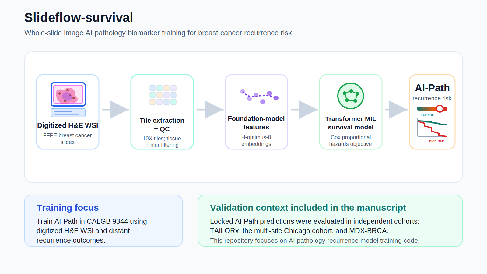

<p align="center">
  
</p>
This repository extends Slideflow to support **direct recurrence prediction** via survival analysis using a custom Cox proportional hazards loss for breast cancer survival model.

## Overview

This project enables **multiple instance learning (MIL)** models to predict **time-to-event outcomes**, such as recurrence, directly from histopathology slide features.

Key features include:

- Custom Cox proportional hazards loss
- Integration with Slideflow MIL pipelines
- Support for right-censored survival data
- FastAI-based training workflow

## Installation
Dependencies for the baseline slideflow package can be installed as follows:

```
pip3 install --upgrade setuptools pip wheel
pip3 install slideflow[cucim] cupy-cuda11x
```

## Training Models for Direct Recurrence Prediction
The example below demonstrates how to train a Slideflow MIL survival model using recurrence-free interval time and recurrence status.

```python
import os
from os.path import join, exists, basename

import torch
from torch import nn

import slideflow as sf
from slideflow.mil import mil_config
from slideflow.mil.train import build_fastai_learner_survival
from slideflow.mil.eval import predict_mil


class CoxPHLoss(nn.Module):
    """
    Cox proportional hazards loss for survival prediction.

    The model output is interpreted as a predicted risk score.
    Higher risk scores correspond to greater predicted risk of recurrence.
    """

    def forward(self, output, target):
        risk_pred = output.view(-1)

        times, events = target
        times = times.view(-1)
        events = events.view(-1)

        if events.sum() == 0:
            return torch.tensor(
                0.0,
                device=output.device,
                dtype=output.dtype,
                requires_grad=True
            )

        # Sort samples by descending survival time.
        order = torch.argsort(times, descending=True)
        risk_pred = risk_pred[order]
        events = events[order]

        # Compute Cox partial likelihood.
        log_cum_hazard = torch.logcumsumexp(risk_pred, dim=0)
        likelihood = risk_pred - log_cum_hazard
        uncensored_likelihood = likelihood * events

        loss = -torch.sum(uncensored_likelihood) / events.sum()

        return loss


# Load Slideflow project.
P = sf.Project("...project directory location...")

# Build dataset.
# Here, `drfi` is the event indicator:
#   1 = recurrence event observed
#   0 = censored
dataset = (
    P.dataset(tile_px=224, tile_um=224)
     .filter({"drfi": ["0.0", "1.0"]})
)

# Configure MIL survival model.
config = mil_config(
    model="attention_mil",
    loss=CoxPHLoss,
    lr=5e-4,
    epochs=8
)

# Train survival model.
learner = build_fastai_learner_survival(
    config,
    train,
    val,
    outcomes="drfi_time",
    event_header="drfi",
    bags="/path/to/feature/bags"
)
```

## Inference
After training, model predictions can be generated using Slideflow MIL evaluation utilities.

```python
from slideflow.mil.eval import predict_mil

predictions = predict_mil(
    learner,
    dataset
)
```
The model output represents a relative recurrence risk score. Higher predicted risk scores indicate greater predicted risk of recurrence.

## Expected Dataset Format
The project annotations should include survival time and event status columns.

| Column | Description |
|---|---|
| `drfi_time` | Time to recurrence or censoring |
| `drfi` | Event indicator, where `1` indicates recurrence and `0` indicates censoring |

Example annotation table:

| slide | patient | drfi_time | drfi |
|---|---|---:|---:|
| slide_001 | patient_001 | 24.3 | 1 |
| slide_002 | patient_002 | 48.0 | 0 |
| slide_003 | patient_003 | 12.7 | 1 |

## License
This project is licensed under the **Creative Commons Attribution-NonCommercial 4.0 International License**.

You are free to:

- Share — copy and redistribute the material in any medium or format
- Adapt — remix, transform, and build upon the material

Under the following terms:

- Attribution — appropriate credit must be given
- NonCommercial — the material may not be used for commercial purposes

See the full license text here: <https://creativecommons.org/licenses/by-nc/4.0/>
